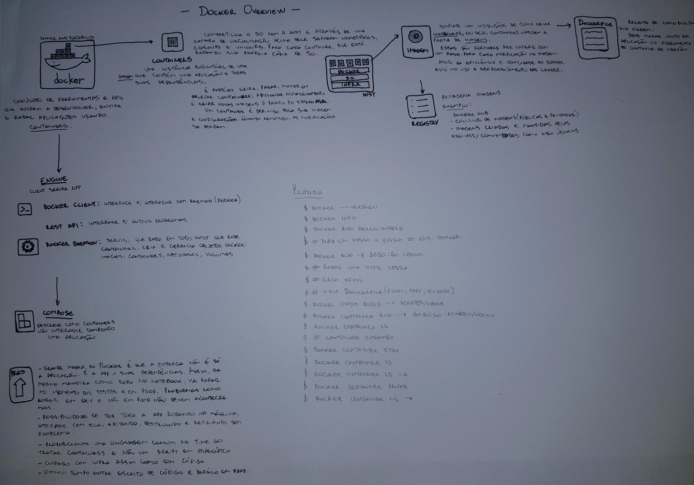

# Docker Overview



```
## Lista comandos Docker CLI
docker
docker container --help

## Mostra versão e informações de Docker
docker --version
docker version
docker info

## Executa imagens Docker
## A imagem hello-world mostra o passo a passo do que acontece ao executar run
docker run hello-world

## Lista imagens Docker
docker image ls

## Lista containers Docker (rodando, todas, todas em quiet mode)
docker container ls
docker container ls --all
## Parâmetro -q é útil quando se quer só o hash de container
docker container ls -aq
```

## Subindo uma página HTML numa imagem base nginx

```

## Vai para a pasta front onde tem uma página HTML e um Dockerfile
cd front

cat Dockerfile

> FROM nginx
> COPY overview.html /usr/share/nginx/html/overview.html
> EXPOSE 80


## Cria imagem com o nome 'front' a partir do Dockerfile
docker image build -t front .

## Roda container 'front' mapeando a porta 8080 local para a porta 80 no container
docker container run -p 8080:80 front

## Em outro terminal...
## Lista todos os containers rodando (container 'front' deve estar nessa lista)
## O ID do container devolvido aqui será usado no próximo comando
docker container ls

## Para container
docker container stop <ID>

## Container 'front' não deve estar na lista
docker container ls

## Container 'front' deve estar na lista mas parado
docker container ls -a

## Remove containers parados
docker container prune

## Container 'front' não deve estar na lista
docker container ls -a

```